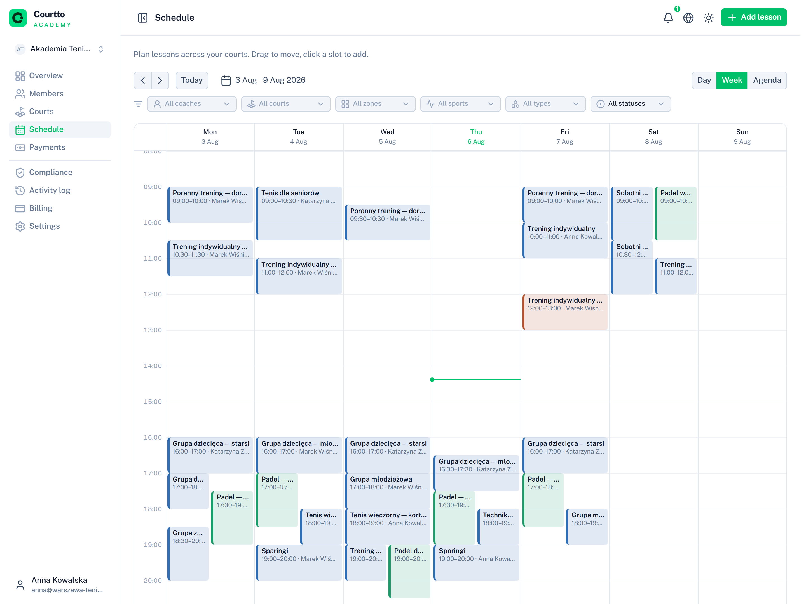
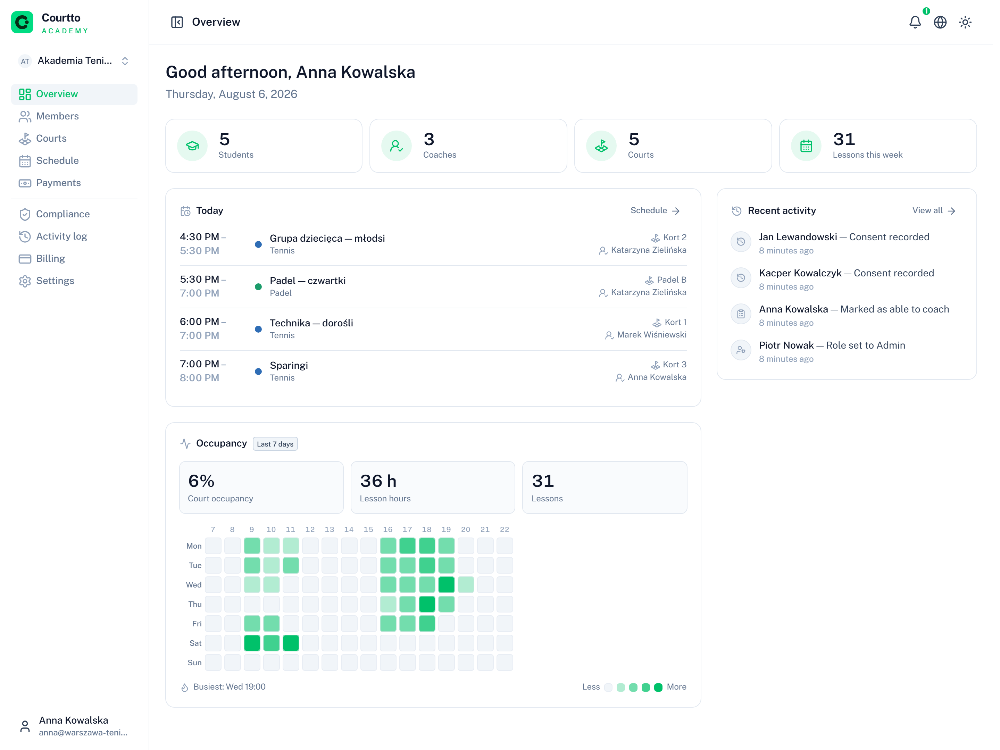
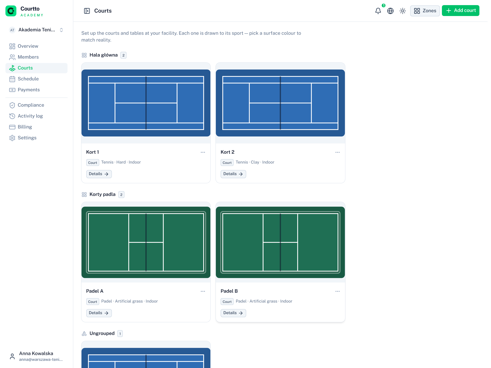
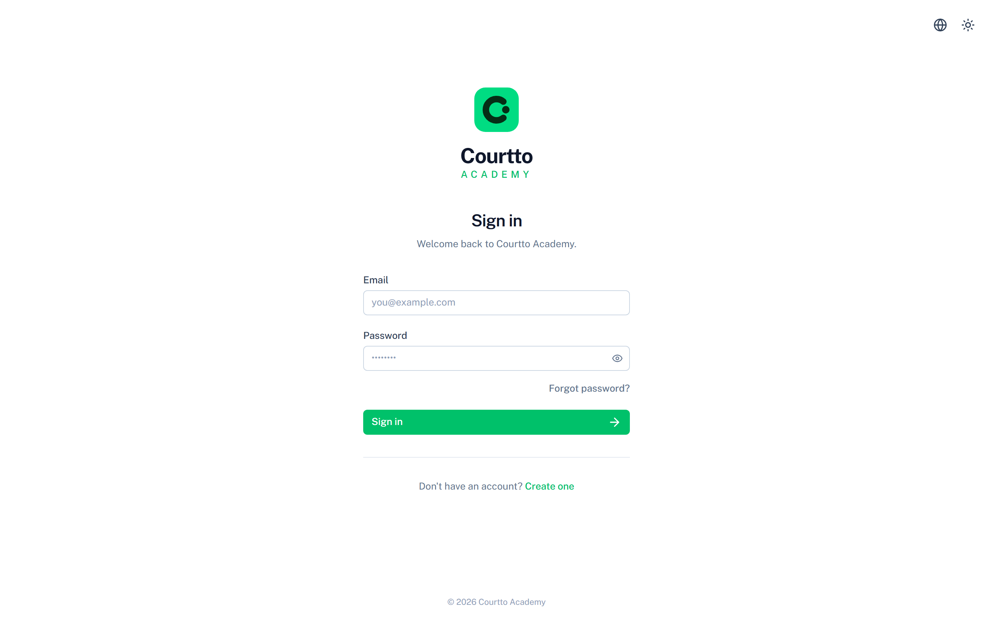

# Courtto Academy

*[Polski](README.pl.md)*

Multi-tenant SaaS for tennis and other racket-sport schools: scheduling, rosters, attendance and payments in one place. Each school is a separate tenant.

A solo side project. My own tennis school had nothing like it, so I decided to try building one as a way to learn, and made it multi-tenant on top of that.

**Stack:** Nuxt 4 · Nuxt UI 4 (Tailwind v4) · Drizzle ORM + PostgreSQL · Better Auth (organization plugin) · Stripe · i18n (en/pl)

## Screenshots

The lesson calendar. Week view puts days in columns, day view puts courts in columns; lessons drag to reschedule and an empty slot opens the create form.



The owner's dashboard: headcount, what's on today, and how busy the courts have been this week.



Courts, grouped by zone. Each is drawn to its own sport — the line pattern comes from the discipline, only the surface colour is stored.



<details>
<summary>Sign in</summary>



</details>

## Running it

```bash
pnpm install
cp .env.example .env    # only DATABASE_URL and BETTER_AUTH_SECRET are required
pnpm db:migrate
pnpm seed               # two demo schools and other sample data
pnpm dev
```

The seed prints a table of accounts, the password for each is `courtto123`. Stripe, S3 and SMTP are optional. Without them the app shows a notice instead of breaking, so the whole thing runs on nothing but Postgres.

## What's in the app?

- **Multi-tenancy** - a school is a Better Auth organization. Every query is scoped by organization id, with isolation covered by tests.
- **Roles and areas** - owner / admin / coach / student, each with its own part of the app (`/school`, `/coach`, `/my`), guarded on both the client and the server.
- **Scheduling** - recurring lessons, where time is stored as wall-clock plus an IANA timezone and resolved separately for each occurrence, so "every Monday at 17:00" stays 17:00 across a DST switch.
- **Conflict prevention** - double-booking a court or a coach is blocked by Postgres `EXCLUDE USING gist` constraints, not only by application checks. One of the tests writes straight to the table to prove the database is the real backstop.
- **Enrolment and attendance** - capacity is enforced under a row lock, so two concurrent enrolments can't both take the last seat. Overflow goes to a waitlist that promotes on cancellation.
- **Payments** - two separate flows: schools subscribe to Courtto, and parents pay schools for lessons via Stripe Connect (direct charges, so the school is the merchant of record and issues its own invoices).
- **GDPR** - guardians for minors, consent records with an audit trail, and a report listing which students still have gaps.

## A few decisions worth mentioning

**Services pattern.** Every Drizzle query lives in `server/utils/services/*`, and API handlers only call services. Authorization and tenancy checks stay in one place instead of scattering across route files, which matters when a missed check means one school reading another's data.

**Shared domain logic.** Validation schemas, permissions and time math live in `shared/`, imported by both the client and the server. A form can't drift apart from its endpoint if the two are built from the same schema.

**Derived, not stored.** A stored flag goes stale the day a birthday passes, so subscription entitlement, profile completeness and whether a student is a minor are all computed on read.

**Core kept separate from Academy.** Courts, reservations, organizations and billing don't reference lessons anywhere. On the same backend I plan to eventually build a sibling product, Courtto, where you'll be able to book things like court rentals.

## Tests

```bash
pnpm test          # unit
pnpm test:server   # integration
pnpm test:e2e      # Playwright
```

## Status

Still being built. Stripe isn't wired to a live account, so the payment flows run against test objects.
